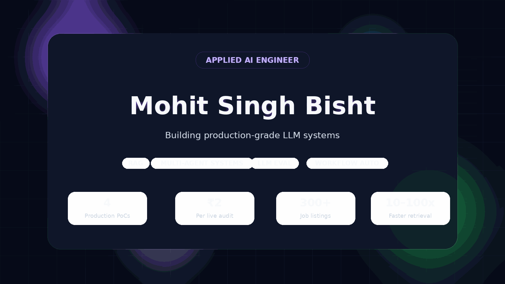
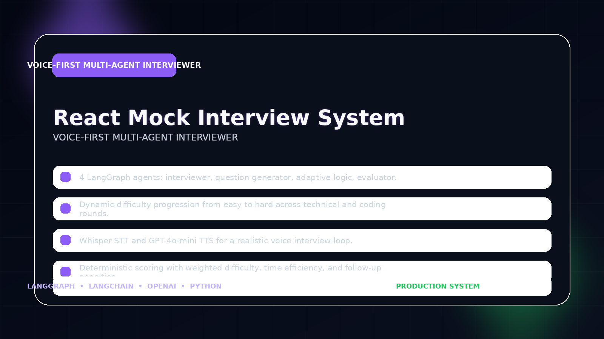
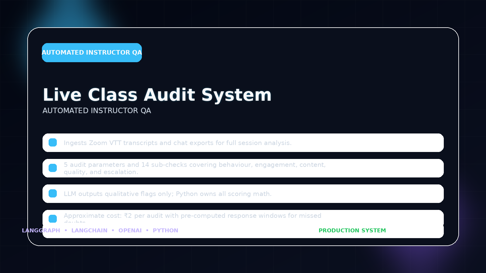
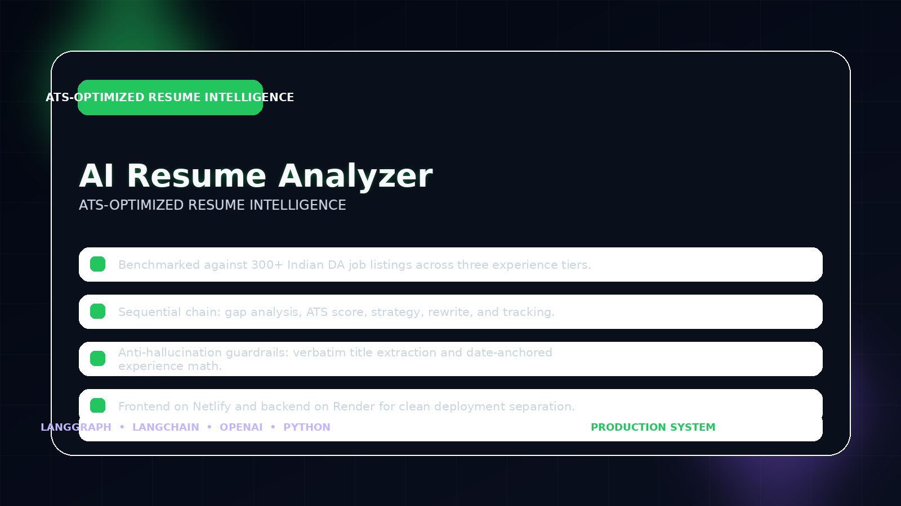
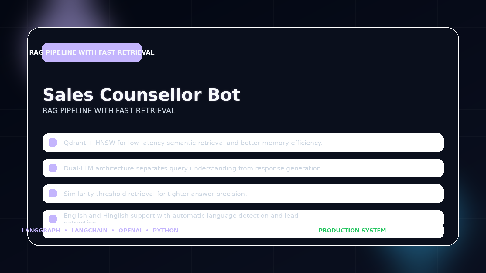
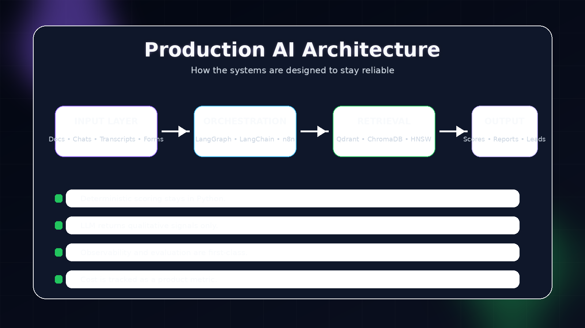

<div align="center">

<p align="center">
  
</p>

[](https://linkedin.com/in/mohit197)
[](https://mohit-singh-bisht-1yt066p.gamma.site/)
[](mailto:rahiviru@gmail.com)

</div>

---

## About Me

Applied AI Engineer at **Coding Ninjas, Gurgaon**, building production-grade LLM systems optimized for reliability, cost, and traceability.

**Focus:** RAG architectures • Multi-agent workflows • LLM evaluation • Workflow automation

---

## Highlights

- **4** production AI systems shipped
- **₹2** per live class audit
- **300+** job listings used in resume analysis
- **10–100x** faster retrieval with HNSW

---

## Featured Work

<p align="center">
  
</p>

<p align="center">
  
</p>

<p align="center">
  
</p>

<p align="center">
  
</p>

---

<p align="center">
  
</p>

---

## How I Build

```python
class MohitSinghBisht:
    role = "Applied AI Engineer @ Coding Ninjas, Gurgaon"
    focus = ["RAG Pipelines", "LangGraph Agents", "LLM Evaluation", "Workflow Automation"]
    shipped = 4
    mantra = "LLM judges quality. Python computes scores. Never swap these."
```

---

## GitHub Stats

<div align="center">
  
  
</div>

<div align="center">
  
</div>

---

<div align="center">
<sub>📍 New Delhi / Gurgaon · Open to AI Engineer roles</sub>
</div>
